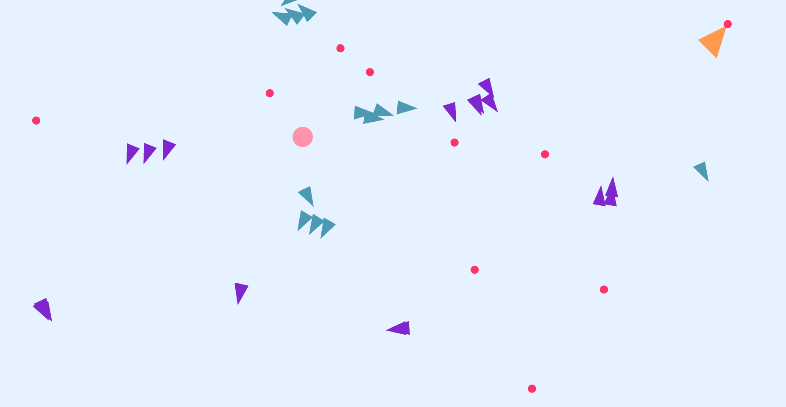
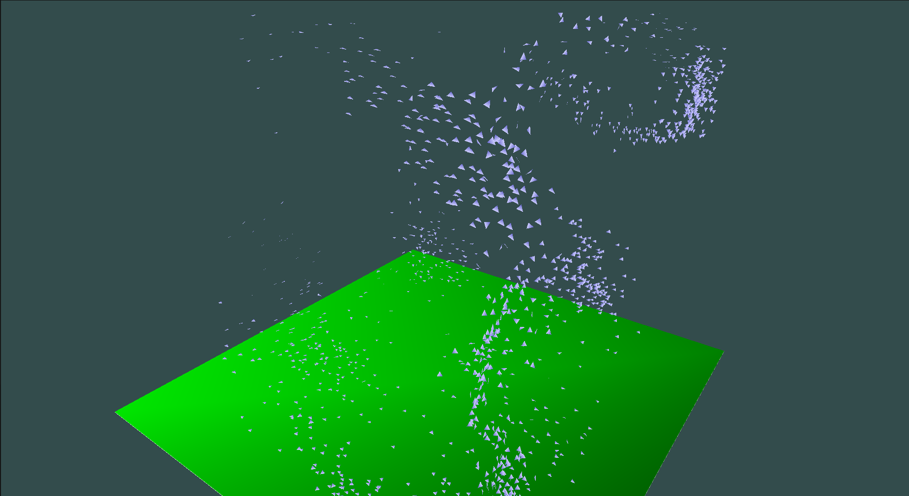
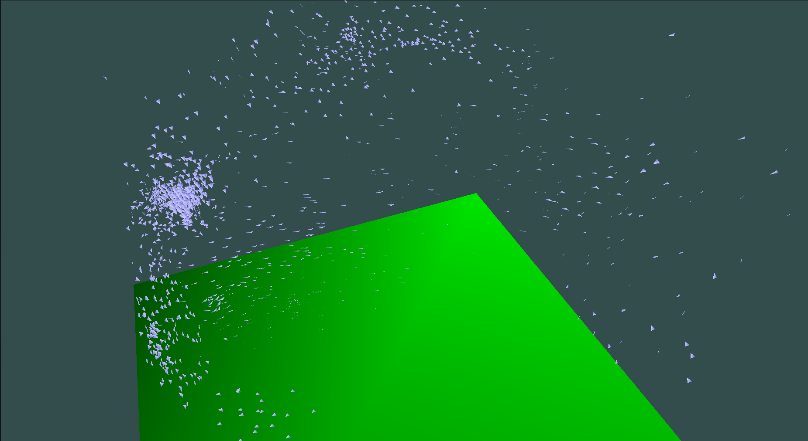
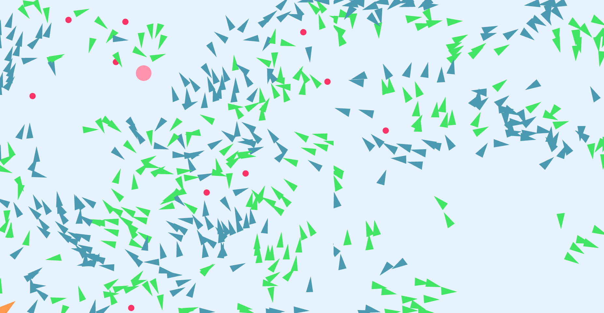
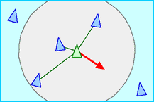
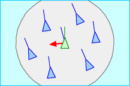
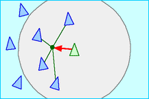

# Craig Reynolds's Boids Behavioral Model

<table>
  <tr>
    <td width="50%"></td>
    <td width="50%"></td>
  </tr>
  <tr>
    <td width="50%"></td>
    <td width="50%"></td>
  </tr>
</table>

This project was made for the course [MAC0420 (Intro. to Computer Graphics)][MAC0420] at IME-USP (University of São Paulo), taught by the professor [Carlos Hitoshi][Hitoshi]. Made with OpenGL 4.5 and WebGL 2.0.

## Flocks and schools

In 1987, [Craig Reynolds][Reynolds] wrote and published a [paper at SIGGRAPH][Paper] in which he takes a deep dive in animal coordination and simulation. He explores a model with generic creatures called _Boids_ that exhibit similar movement as a bird flock or a fish school.

In summary, Reynolds sets three steering behaviours that each _Boid_ needs to follow:

#### Separation

Each _boid_ steers away from obstacles and other _boids_ in order to avoid crowding its own school.

 
 

#### Alignment

Each _boid_ goes towards the average heading of its local flockmates. It sets its velocity to match the average, too.

 
 

#### Cohesion

Each _boid_ moves towards the average position of its local flockmates.

 

## Simulated Flocks

In Reynolds's paper, he states that _boids_ are a generalization of particle systems. However, his implementation differs from these sytems by changing the geometrical shape of the particles from dots to real shapes, giving each _boid_ an orientation. Another difference he states is the complex behaviour compared to particles.

My implementation follow Reynolds's philosophy, although each object in the scene is treated as a dot, it cannot be assumed as a particle system.

## Details Added

By suggestion of the course professor, I have implemented some extra details to give the simulation more life and/or complexity.

### OpenGL

##### Linear boid algorithm!

By implementing a spatial hashing algorithm into boid behaviour, I reduced the simulation's time complexity from O(n²) to O(n)

### WebGL

##### Obstacles

The simulation is filled with a specific number of obstacles in which the _boids_ avoid. These can separate a _boid_ from a school, forcing it to follow a natural path to find a new one.

##### Multiple schools

A new steering rule was added to give each _boid_ a school group in which it shares with other flockmates, each school group has a random assigned color and a random number of flocks. Every _boid_ only has alignment and cohesion to other mates that belong to the same school, running away from other _boids_ that belong to different schools.

##### _Boid_'s Leader

The model has one specific _boid_ that doesn't follow any rules and has a semi-automatic movement controled by the user. It doesn't belongs to any school group and affects its flockmates behaviour, although its behaviour only changes within user input.

##### Predator

The simulation has a predator flying over the _boids_, the mouse input controls its position. Contrary to the nature of predators, this one doesn't eat any _boids_ but scare them. Every _boid_ tries to run away from the predator in the same way as they avoid obstacles.

##### Flocking animation

An exclusive shader for the _boids_ was made to give them a nice flocking animation.

## Simulation Parameters

Every aspect of the model has a parameter that can be altered. These parameters can be found at [scene-config.js](src/scripts/scene-config.js)

## Controls

### OpenGL

#### Camera

- `a`, `w`, `s`, `d`: Move Camera

- `mouse`: Rotate Camera

- `mouse scroll`: Camera zoom

#### Scene

- `r`: Reset Boids

- `h`: Toggle aquarium wireframe/borders

- `g`: Toggle ground render

### WebGL

- `+` / `=` : Adds a new _boid_ to the simulation
    - On initialization, a random group and, therefore, a random color is given to the created _boid_

- `-` : Remove the latest created _boid_
    - The leader cannot be removed

- `Arrows`: Control the leader

- `P`: Pause the simulation

- `s`: When paused, advances one frame into the simulation

## Acknowledgements and References

This project was heavily inspired by [Reynolds's paper][Paper] and his [2001 article][Article].

Professor [Carlos Hitoshi][Hitoshi] also provided immense help by offering references and helping with the model implementation, either through his [Computer Graphics Book][CGBook] and his lectures in the [Intro. to Computer Graphics course][MAC0420].

[MAC0420]: https://uspdigital.usp.br/jupiterweb/obterDisciplina?nomdis=&sgldis=MAC0420
[Hitoshi]: https://www.ime.usp.br/~hitoshi/
[CGBook]: https://panda.ime.usp.br/introcg/static/introcg/
[Reynolds]: https://www.red3d.com/cwr/index.html
[Paper]: https://graphics.stanford.edu/courses/cs448-01-spring/papers/reynolds.pdf
[Article]: https://www.red3d.com/cwr/boids/